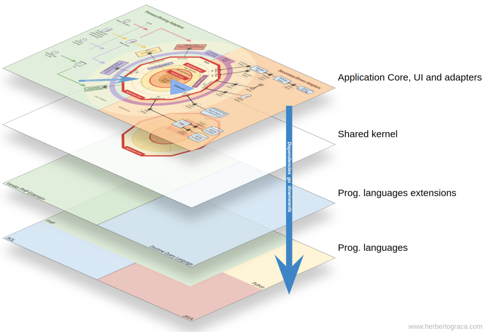

# Node Microservices Template

Node Microservices Template using Driven Design Domain (DDD), CQRS and Event Sourcing

## Architecture

Architecture diagrams





## Project structure

This project is structured by libraries and modules

```
├── .vscode                               # VSCode configuration to settings typescript version
│   └── settings.json                    
├── libs                                  # Folder that contains the libs for the microservices
│   ├── kernel                            # Shared Kernel (@micro/kernel)
│   ├── logger                            # Centralized library for logs both node js and browsers (@micro/logger)  
│   ├── server                            # Centralized library for create custom server using NestJS (@micro/server)  
│   ├── server-graphql                    # Centralized library for create custom server with graphql using NestJS (@micro/server-graphql)  
│   └── utils                             # Library for validations, extensions, etc. (@micro/utils)  
├── microservices
│   ├── bounded context
│   │   ├── app
│   │   ├── config
│   │   ├── core
│   │   │   ├── application
│   │   │   │   ├── dtos
│   │   │   │   ├── mappers
│   │   │   │   └── use-cases
│   │   │   ├── domain
│   │   │   │   ├── errors
│   │   │   │   ├── factory
│   │   │   │   ├── repository
│   │   │   │   └── services *
│   │   │   ├── infraestructure
│   │   │   │   ├── database *
│   │   │   │   ├── http *
│   │   │   │   ├── services *
│   │   │   │   ├── mappers
│   │   │   │   └── repository
│   │   ├── interfaces
│   │   │   ├── console
│   │   │   │   ├── commands
│   │   │   │   └── app.js
│   │   │   ├── graphql
│   │   │   │   ├── core
│   │   │   │   ├── models
│   │   │   │   ├── modules
│   │   │   │   └── main.js
│   │   │   └── rest
│   │   │   │   ├── core
│   │   │   │   ├── modules
│   │   │   │   └── main.js
└── README.md